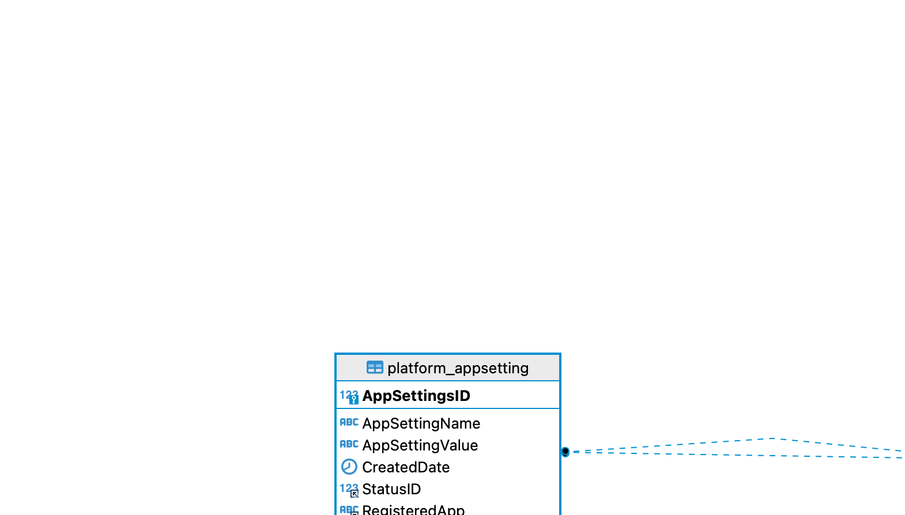
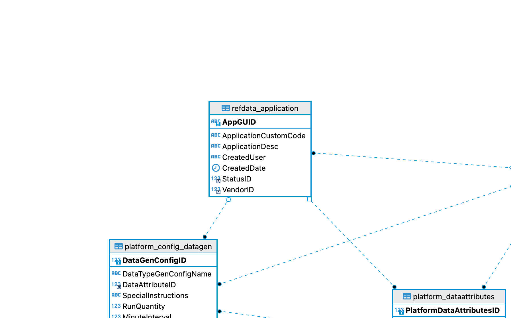
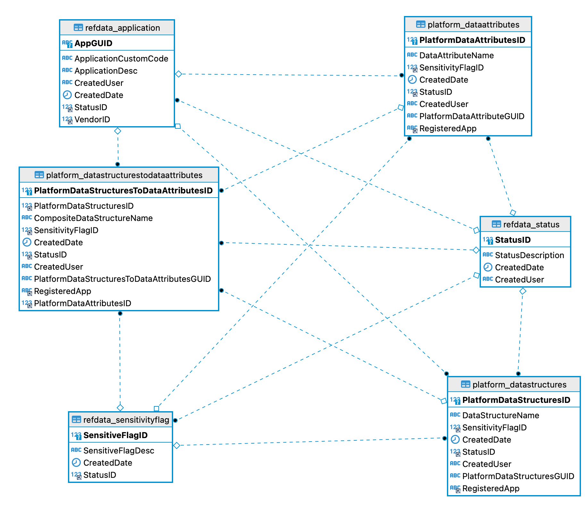
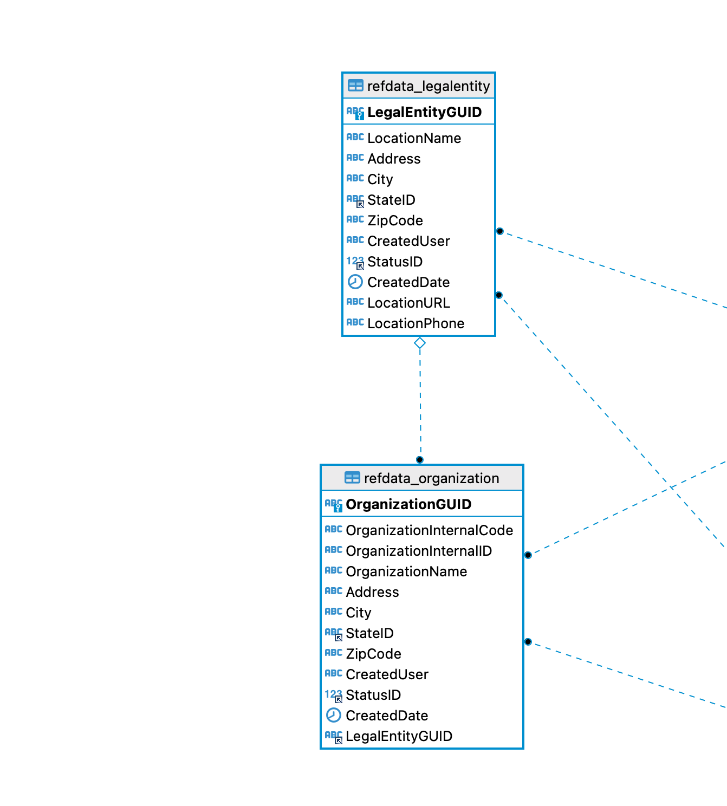
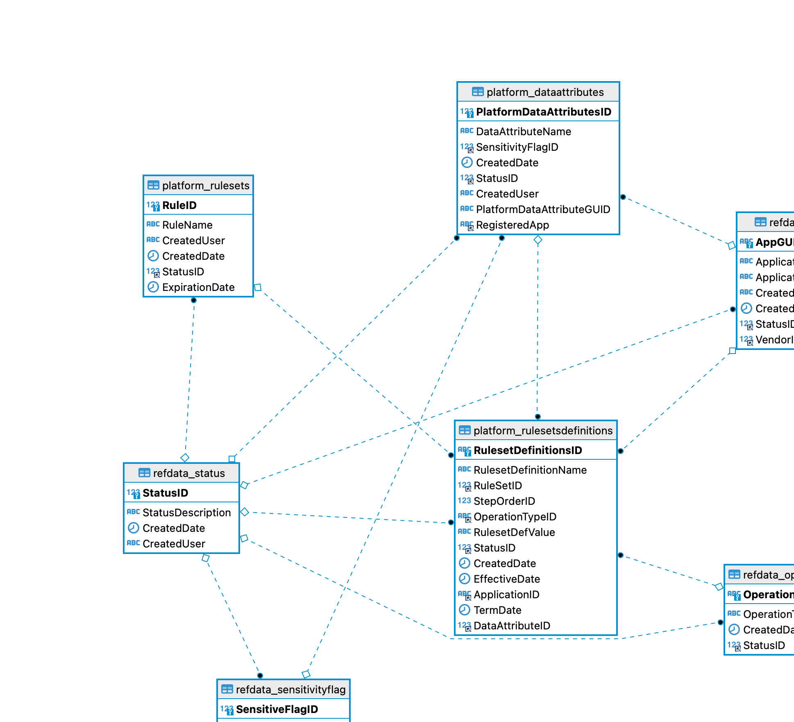
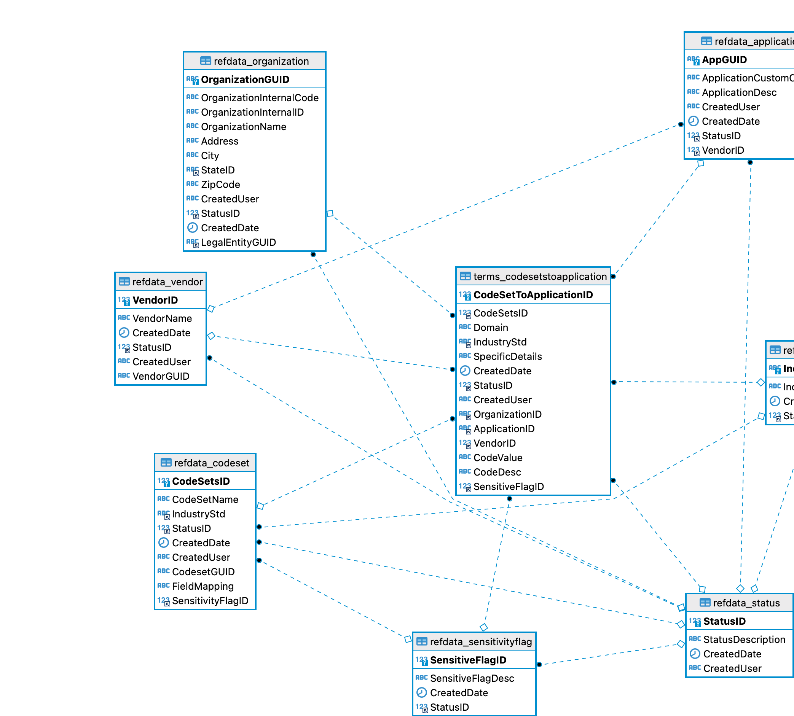

# DataSynthesis DataModel
The following content is designed to specifically break up the datamodel
into a few key areas.

# DataSythesis Artifacts
It is also important to note we have included several usable artifacts that  
help provide a detailed understanding of the Datasynthesis Data Model.

# DataSynthesis DataModel Explained
The power of this platform is enabling the massive amount of ways data can be used and stored
within the model. As part of that we want to ensure we try and provide as much detail as we
can, we have several visuals we are providing to get everyone started.

# DataSynthesis Data Model Platform Setup for Usage Readme
Now that we have given you a general rundown of the data tier amd
how to get the database setup it is important for usage as you go
to implement it.

The platform data tier setup establishes several key reference and base data
for the platform. We have ensured we include required reference data and
a ton of existing and generated data to start. With all that being said
as you look to add your organization we wanted to provide you some details
and context as to how to ensure you maximize the platform and also use
it effectively.

# Hiarchy/Order of Setting Things Up
Having installed the DDL and loaded the data into your platform now it might help to understand the
hiarchy of how the data is used.

1. Vendors - any company that has an application running in an Organization, they must be defined as a vendor.
2. Legal Entities - This is intended to be a logicl grouper by what facilities/stores/orgs are associated to this legal entity.
3. Organizations - The specific locations dealing with ANY level of information. This can be thought of a clinic, store, practice, and so forth.
4. Applications - anything that is producing data that you want to define data processing rules
   for. DataSynthesis is provided to the database as a defualt application as it is producing data. The
   key attribute created here is the Application GUID. This is used through out the platform for many purposes
5. Data Attributes - Specific data artifacts at the lowest level the platform provides. These are things
   like First Name, Last Name, Phone Number, Area Code, Phone Number, Drivers License Number, etc. These are provided by the load scripts and ANY messing with these will provide unknown platform behavior.
6. Data Structures - What you build from data attributes. Things like Full Name, Complete Address, Phone Number
   and so forth. These are provided by the load scripts and can be extended based on imlementation or data needs.
7. Codesets - The baseline for where ANY custom codes live for ANY defined application, while there is a mention of Industry
   Standard the standard can be custom as needed.
8. Terms - This leverages the codesets defined to pull in ANY specific codes that need to be leveraged into the platform.
   By doing this we can focus on the specific codes and their description specific to a defined application for a specific
   organization
9. Terms Codeset To Application Values - This is where the specific details like code and description or code and complex data attributes are captured so when data
   will need to be generated we can make it real world based. This is ALWAYS built upon the Organization and Application sending the data.

## Application Settings
Application Settings are the way certain data and operations are tagged in the system
so having these established and setup is key. Additionally, as new capabilities are added application
settings are viewed by the platform as "tags".

## Data Generation
Data generators is a critical key aspect of the platform that will continue to be leveraged and expanded.
Data generation for the platform is intended to leverage code assets to build data artifacts based on
how the platform is configured.

## Data Structures
This is all about Building out what complete data the platform can represent.

## Organizations
Who is using the data and where they are located.

## Rulesets
Specific rules we want the platform to be able to process and maintain.

## Terms
Specific coded data and how we can enable it to be processed to enable more accurate and robust data processing.

